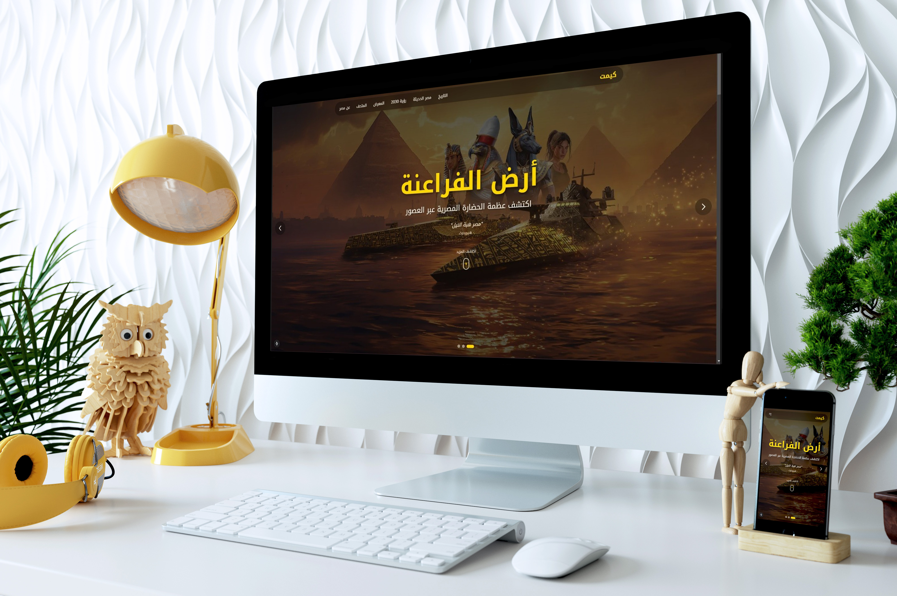

# 🔮 Kemet - A Journey Through Ancient & Modern Egyptian Civilization

<div align="center">



**An immersive, interactive experience exploring the rich tapestry of Egyptian heritage**

[](https://nextjs.org/)
[](https://www.typescriptlang.org/)
[](https://tailwindcss.com/)
[](https://www.framer.com/motion/)

[Live Demo](https://kemet-virid.vercel.app/) • [Report Bug](https://github.com/eneryu/kemet/issues) • [Request Feature](https://github.com/eneryu/kemet/issues)

</div>

---

## 👁️ The Kemet Vision

"Kemet" (Black Land) was the name used by ancient Egyptians to refer to their fertile soil and their nation. This project aims to bridge the gap between the monumental past and the ambitious future. By combining 3D artifacts, historical encyclopedias, and modern urban milestones, Kemet offers a digital tribute to the spirit of Egypt.

---

## ✨ Features

<table>
<tr>
<td width="50%">

### 🎨 **Modern Design**
Stunning UI inspired by ancient Egyptian art with contemporary UX principles

### 📚 **Rich Content**
Comprehensive historical narratives presented in an engaging, story-driven format

### 🖼️ **Interactive Gallery**
Explore artifacts and monuments through an immersive visual experience

</td>
<td width="50%">

### 🏺 **Virtual Museum**
Digital collection of significant archaeological treasures

### 🌐 **Full Arabic Support**
Native RTL support with seamless Arabic typography

### ⚡ **Blazing Fast**
Optimized performance with Next.js 15 App Router

</td>
</tr>
</table>

---

## 🚀 Tech Stack

| Category | Technology |
|----------|-----------|
| **Framework** | Next.js 15.1 with App Router |
| **Language** | TypeScript 5.0 |
| **Styling** | Tailwind CSS 3.4 |
| **Animations** | Framer Motion 11.15 |
| **UI Components** | Radix UI |
| **Icons** | Tabler Icons React |
| **Deployment** | Vercel |

---

## 🛠️ Getting Started

### Prerequisites

- Node.js 18.0 or higher
- npm or pnpm

### Installation

```bash
# Clone the repository
git clone https://github.com/eneryu/kemet.git

# Navigate to project directory
cd kemet

# Install dependencies
npm install
# or
pnpm install

# Run development server
npm run dev
# or
pnpm dev

# Build for production
npm run build
# or  
pnpm build

# Start production server
npm start
# or
pnpm start
```

Open [http://localhost:3000](http://localhost:3000) to view the app in your browser.

---

## 📁 Project Structure

```
kemet/
├── src/
│   ├── app/              # Next.js app directory
│   │   ├── layout.tsx    # Root layout
│   │   ├── page.tsx      # Home page
│   │   └── ...           # Other pages
│   └── components/       # React components
│       ├── ui/           # UI components
│       └── ...           # Feature components
├── public/               # Static assets
├── screenshots/          # Project screenshots
└── ...config files
```

---

## 🎯 Key Features

### 🌟 Responsive Design
- Fully responsive layout optimized for all devices
- Mobile-first approach with smooth transitions
- Adaptive typography and spacing

### 🎭 Immersive Animations
- Smooth page transitions with Framer Motion
- Interactive hover effects and micro-interactions
- Scroll-triggered animations for enhanced storytelling

### 📱 Progressive Web App
- Optimized loading with Next.js Image component
- SEO-friendly with proper meta tags
- Fast page transitions with client-side routing

---

## 🌐 Deployment

This project is deployed on [Vercel](https://vercel.com), the platform built by the creators of Next.js.

**Production URL**: [kemet-egyption-civilization.vercel.app](https://kemet-egyption-civilization.vercel.app/)

### Deploy Your Own

[](https://vercel.com/new/clone?repository-url=https://github.com/eneryu/kemet)

---

## 👨‍💻 Developer

<div align="center">

**Eneryu (Jack)**

[](https://github.com/eneryu)
[](mailto:jackezt4@gmail.com)
[](https://wa.me/2001014023583)

</div>

---

## 📝 License

```
MIT License

Copyright (c) 2024-2025 Kemet - Eneryu

Permission is hereby granted, free of charge, to any person obtaining a copy
of this software and associated documentation files (the "Software"), to deal
in the Software without restriction, including without limitation the rights
to use, copy, modify, merge, publish, distribute, sublicense, and/or sell
copies of the Software, and to permit persons to whom the Software is
furnished to do so, subject to the following conditions:

The above copyright notice and this permission notice shall be included in all
copies or substantial portions of the Software.

THE SOFTWARE IS PROVIDED "AS IS", WITHOUT WARRANTY OF ANY KIND, EXPRESS OR
IMPLIED, INCLUDING BUT NOT LIMITED TO THE WARRANTIES OF MERCHANTABILITY,
FITNESS FOR A PARTICULAR PURPOSE AND NONINFRINGEMENT. IN NO EVENT SHALL THE
AUTHORS OR COPYRIGHT HOLDERS BE LIABLE FOR ANY CLAIM, DAMAGES OR OTHER
LIABILITY, WHETHER IN AN ACTION OF CONTRACT, TORT OR OTHERWISE, ARISING FROM,
OUT OF OR IN CONNECTION WITH THE SOFTWARE OR THE USE OR OTHER DEALINGS IN THE
SOFTWARE.
```

---

## 🙏 Acknowledgments

- Inspired by the rich heritage of ancient Egypt
- Built with modern web technologies
- Designed with love for Egyptian culture

---

<div align="center">

**Made with ❤️ by [Eneryu](https://github.com/eneryu)**

⭐ Star this repo if you like it!

</div>
